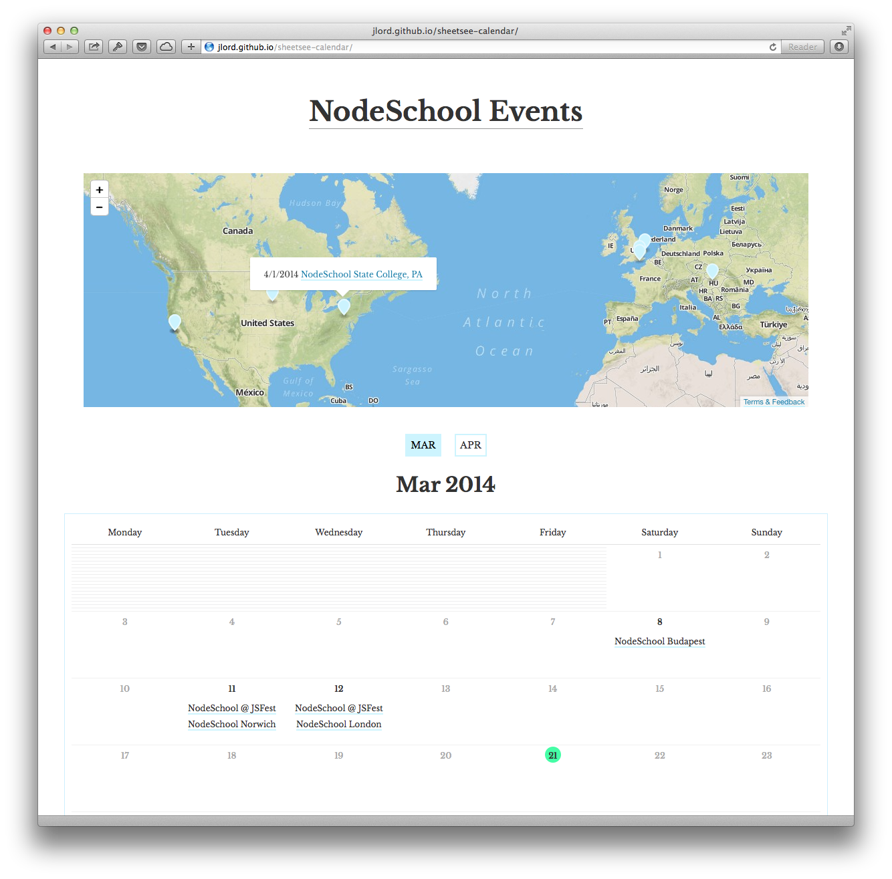

# Including a Map

If you want to include a map on your calendar page, the `with-map` [branch](https://github.com/jlord/sheetsee-calendar/tree/with-map) has it all set up for you.

For more on using Sheetsee.js to generate maps, read the [documentation](http://jlord.github.io/sheetsee.js/docs/sheetsee-maps.html).

## Geocoding  

Geocoding is turning addresses (i.e. "Sydney, Austrailia" or "1600 Pennsylvania Avenue") into lattitude and longitude coordinates (i.ee "49.560, 12.089").

Most map providers require you to sign up for a special key to be able to use their geocoding services. There are a couple slightly easier ways to do it without a key.

- **Find the lat/long coordinates yourself.** You can add a 'lat' and a 'long' column to  your sreadsheet and manually add the coordinates yourself from typing the address into a site like [latlong.net](http://www.latlong.net).
- **Use MapBox's city-level Geocoder Plugin** MapBox has a Google Spreadsheet [plugin](https://www.mapbox.com/tilemill/docs/guides/google-docs/#geocoding) that creates an extra 'Geo' menu at the top of your spreadsheet. With this you can select a column of addresses and geocode them to the city-level (not street-level). When selecting a geocoding service, choose MapQuest and you can leave the API key field blank.
 - _Note: When using this option, the plugin generates latitude and longitude columns named 'geo_latitude' and 'geo_longitude'. To make the map, Sheetsee.js needs you to name those columns 'lat' and 'long' instead. So each time you add a row, you'll need to regenerate all the coordinates and rename the columns. Not ideal, I know, but see my note on `sheetsee-maps` below._

### sheetsee-maps

The part of Sheetsee.js that handles maps is called [sheetsee-maps](http://github.com/jlord/sheetsee-maps). Currently it expects lattitude and longitude to come in from a spreadsheet in two columns, one named 'lat' and one named 'long'. I've opened an [issue](http://github.com/jlord/sheetsee-maps/issues/1) to update the library so that it also accepts:

- two columns named 'latitude' and 'longitude'
- one column named 'lat/long'
- two columns named 'geo_latitude' and 'geo_longitude'

The last item is so that people using the MapBox plugin do not need to rename their columns everytime they generate the coordinates.

I'll be making this update as soon as I can.
